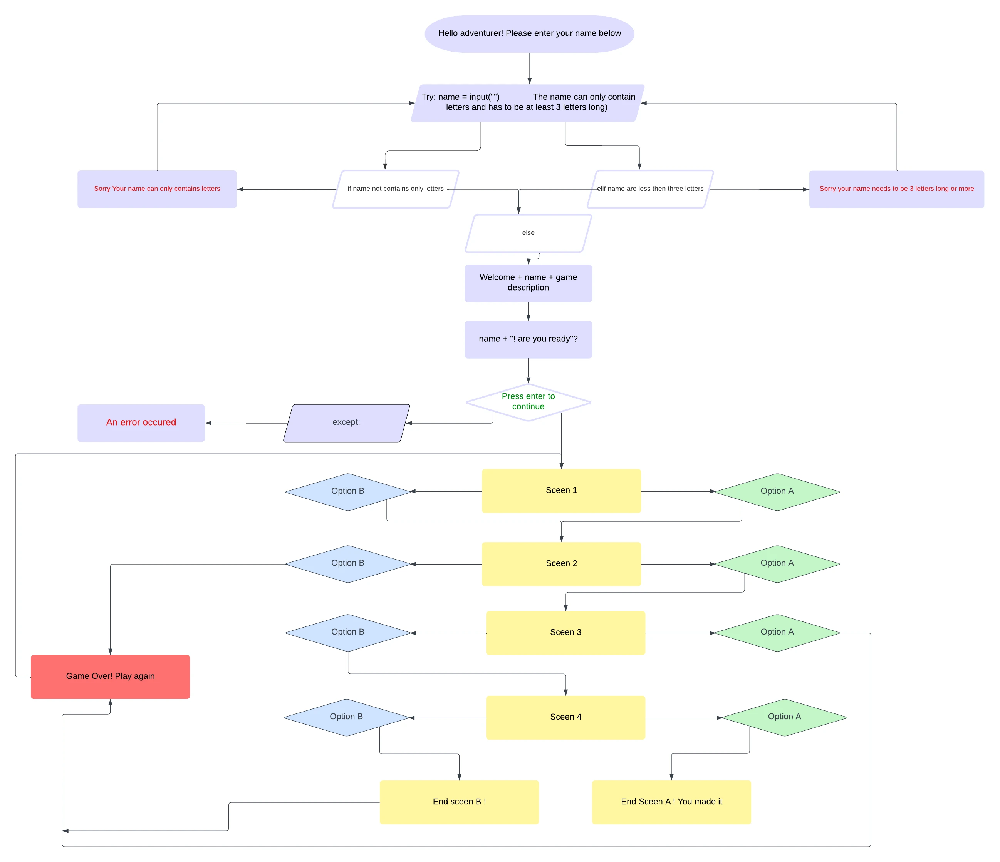
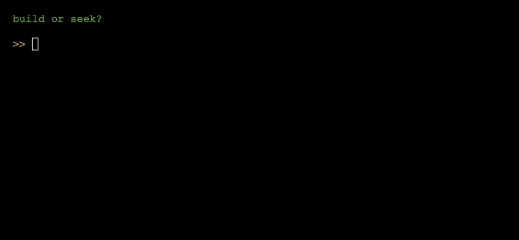

# The Lost Island

[Live site](https://lost-island-82a0005e081c.herokuapp.com/)
## Introduction
This is a text-based adventure game.

The game invites the user to an exciting interactive story, where the user's different choices controls the direction of the story.

### Project goals

- Write code that is clean and readable.

- Write code where the user is interactive in the story.

- Hold the user's interest with an exciting story.

- Create a design that lightens up the text and makes the game user-friendly.

## Data Model
### Flowchart
I used a flowchart from [Lucidchart](https://www.lucidchart.com/pages/ER-diagram-symbols-and-meaning)
to map out how I envisioned the logic of the game. This flowchart is a basis for the most important functions and directions of the game. Therefore, the number of scenes may differ from the final result.

### Functions
The primary functions used on this application are:

- `print()`
    - Prints out different questions to the user.
- `print_slow()`
    - Typing the text slow.
- `input()`
    - Prompts the user to make different choices.
- `clear()`
    - clears the console.
- `time.sleep()`
    - Delay the text before it clears out.
- `restart()`
     - Restart the game.
- `welcome()`
    - Displays the title of the game
- `intro()`
    - displays an intro text
- `the_stranded_friends()`
    - Displays main scene one.
- `the_shelter()`
    - Displays main scen two
- `the_serch_for_water()`
    - Displays main scene three
- `mountain_top()`
    - Displays main scene four
- `the_rescue()` 
    - displays main scene five.
- `main()`
    - Calls all the game functions 

### Design
Since this is a text-based game, I have made an active choice not to validate the inputs where the user is prompted to press `enter` to be interactive. These inputs are part of the design and their purpose is to keep the user interested in the game. 

An example of such input is shown below:

In my design, I have also made frequent use of:

- `\n` for new line.
- `\t` for move the text a bit towards the center.

The colors used are well chosen:

- `Red` is used for error messages.

- `White` is used for the narration.

- `Yellow` is used for the user's voice.

- `Blue` is used for the friend's voice.

- `Green` is used when the user is expected to be interactive in the game.
 
All these choices are to lighten up all the text, and make the game more user-friendly.

### Imports
I've used the following Python packages and/or external imported packages.

- `sys`: used for the restart() and print_slow() functions.
- `os`: used for the clear() function.
- `time`: used for time.sleep()function.
- `pyfiglet`: used for including the ASCII art.
- `colorama`: used for including colors.

## Features
### Existing features
 - Welcome
    - The game's title with ASCII art and a welcome text with a question is dispalyed.
    The user is prompted to answer.

    `If the answer are no:`

    

    `If the answer are yes:`
    
    

- The game
    - When the user hits enter, the game starts with an intro and then the first scene in the game dispalyes.

    `part of scene one:`

    

- The Main scenes
    - In all the main scenes there are always two options to choose from.   
    
    

- The options
    - One option leads the user forward to win. While the other option leads the user to the end of the game, and the user is prompted to play again. Except in the first main scene where both options move the game forward

    `example of an ending scene:`

    

    `example of when the game continues:`

    
- To survive the island
    -  The user must make it all the way to the rescue and leave the island to survive this adventure. When the user succeeds the game restarts.

    
    `part of the final scene`

    
### Future features
- Add inventory that will be needed later in the story. 
The end of the game depends on what the user has managed 
to pick up from the inventory.

- Add more options to choose from in the story.

- Add more dangers to the story.

- Add so it can be two players.

## Technologies
- [Python](https://www.python.org/) used as the back-end programming language.
- [Git](https://git-scm.com/) used for version control. (git add, git commit, git push)
- [GitHub](github.com) used for secure online code storage.
- [Gitpod](https://gitpod.io/) used as a cloud-based IDE for development with Code Institutes template.
- [Heroku](https://dashboard.heroku.com/apps) used for hosting the deployed back-end site.

## Testing
Throughout this project I have been testing the game by running it in the gitpod terminal and Heroku terminal.

Below, all the validation that has been done is shown.

### Input Validation
As I discussed in the `design` section, I have only validated the inputs that are the main key for the game to continue. 

- The gifs show that error messages with instructions are displayed if the user enters an invalid answer.
 #### The yes or no input

#### The name input

#### The build or seek input

#### The go in or go around input

#### The right or left input

#### The path or climb input

### Code Validation
- The code has been run through the Code Institutes Linter with no errors.

## Solved Bugs
- My code broke in the_serch_for_water() function where the user's input are validated.
    - I had forgotten to give the input a specific name and solved this by naming that input to userInput.
- It was also broken in other validated inputs. 
    - I solved this by adding .lower after each validated input. 
## Unresolved Bugs
- No unresolved bugs.
## Deployment
### Adding, committing and pushing code
- All code has been pushed to the repository [adventure-game].(https://github.com/Linnea87/adventure-game)
- All code has been regurlary added, committed and pushed throughout the project.
- The commands being used are `git add <file>`,
  `git commit -m “commit message”` and
  `git push`
- Due to being completely brand new into this tech world, the `git commit -m “commit message”` have gradually improved throughout this project. 
### Deploying to Heroku
I deployed my project directly to Heroku by doing the following:

- Created an account at Heroku.com.
- Installed my own packages in the requirements.txt terminal by typing `pip3 freeze --local > requirements.txt`.
- Clicked on "Create new app" and named it adventure-game.
- Clicked on Settings and added Backpacks - Python and Node.js.
- Made sure the backpacks were in the right order.
- From the new app Settings, I clicked Reveal Config Vars, and sets the value of KEY to PORT, and the value to 8000 then selected add.
- Connected my GitHub profile and found the right Repository.
- Manually deployed the page and clicked "Eanble automatic deploys" at the same time.
## Credits

**Source**|**Location**|**Notes**
:-----:|:-----:|:-----:
[Colorama](https://pypi.org/project/colorama/)|Adventure-game terminal|Page to help add colors in the terminal
[Pypi](https://pypi.org/project/pyfiglet/)|Adventure-game terminal|ASCII art came from this page
[Figlet](https://www.figlet.org)|Adventure-game terminal|ASCII font style came from this page
[Stack overflow](https://stackoverflow.com/questions/4099422/printing-slowly-simulate-typing)|Adventure-game terminal|Type slow function inspired from this page
[Geeks for geeks](https://www.geeksforgeeks.org/clear-screen-python/)|Adventure-game terminal|Clear function are inspired from this page
[Python long-string](https://note.nkmk.me/en/python-long-string/)|Adventure-game terminal|Inspired from this page to split code when one line exceeds 80 characters
[Stack overflow](https://stackoverflow.com/questions/10506973/can-not-increment-global-variable-from-function-in-python)|Adventure-game terminal|Inspired how to use the global key  to transfer variables from one function to another
[Github](https://gist.github.com/jrosco/d01b28c2f37100bb5278)|Adventure-game terminal|Code that are modify for restart the game

## Acknowledgments

- Thanks to my mentor [Graeme Taylor](https://github.com/G-Taylor) who always gives me good tips, advice and feedback on how to plan and implement my projects. And for this project advised me how to best use the flowchart and gif recording.