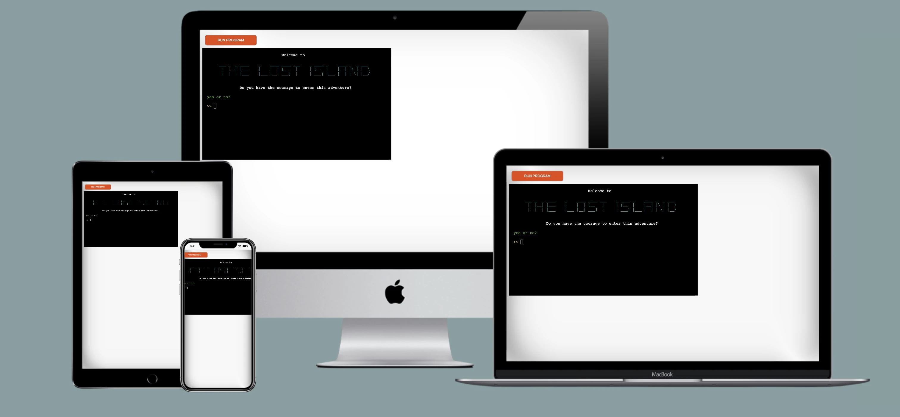

# The Lost Island

[Live site](https://git.heroku.com/lost-island.git)
## Introduction
This is a text-based adventure game.

The game invites the user to an exciting interactive story, where the user's different choices controls the direction of the story.

## Data Model
### Flowchart
I used a flowchart from [Lucidchart](https://www.lucidchart.com/pages/ER-diagram-symbols-and-meaning)
to map out how I envisioned the logic of the game. This flowchart is a basis for the most important functions and directions of the game. therefore, the number of scenes may differ from the final result.

### Imports
I've used the following Python packages and/or external imported packages.

